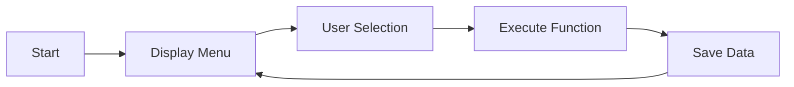
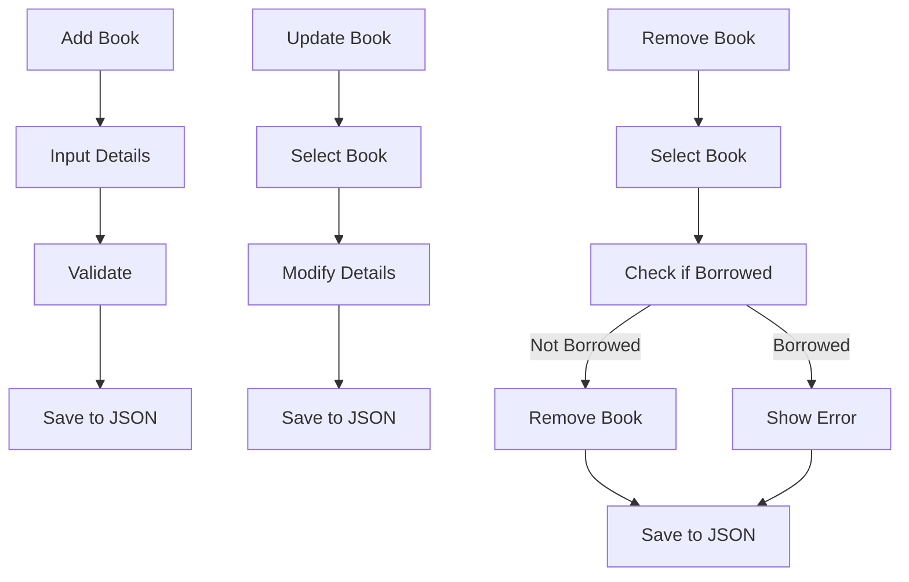
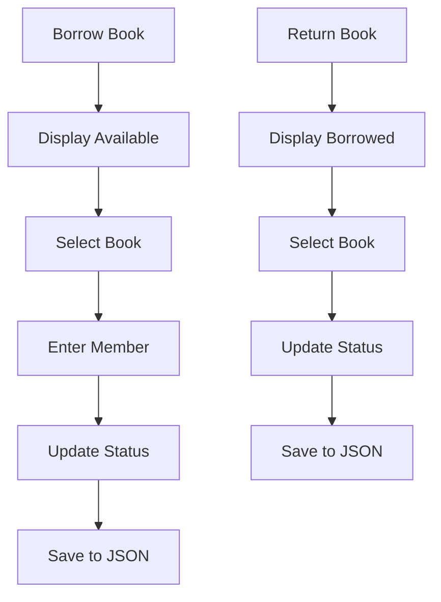

<div align="center">
  
</div>

# Library Book Borrowing System

A comprehensive command-line application designed for managing library books and their borrowing status. This system provides a complete solution for librarians to efficiently handle book inventory, member borrowing, and return processes.

## Overview

This Library Book Borrowing System is a Python-based application that streamlines library operations through an intuitive command-line interface. The system manages book inventory, tracks borrowing status, and maintains persistent data storage using JSON files.

## Features

- **Book Management**: Add, update, remove, and display books
- **Inventory Control**: View all books, available books, or borrowed books  
- **Search Functionality**: Find books by category
- **Borrowing System**: Handle book borrowing and return processes
- **Data Persistence**: Automatic saving and loading of library data
- **Testing Suite**: Comprehensive test scenarios for validation
- **Member Tracking**: Track which members have borrowed specific books

## Project Structure

| File Name | Description |
|-----------|-------------|
| `main.py` | Main application entry point handling user menu and interaction |
| `book_manager.py` | Contains functions for managing book details (add, update, remove, display) |
| `borrow_manager.py` | Contains functions for handling book borrowing and returning |
| `file_storage.py` | Manages saving and loading library data to/from JSON files |
| `test_runner.py` | Interactive script for running specific test scenarios and inspecting data |
| `library_data.json` | Main data storage file (created automatically) |
| `test_library_data.json` | Test data storage file (created during testing) |

## Installation

1. **Clone or Download** the project files to your local machine
2. **Ensure Python is installed** on your system (Python 3.6 or higher recommended)
3. **Navigate to the project directory**
4. **No additional dependencies required** - uses only Python standard library

## Usage

### Running the Main Application

```bash
python main.py
```

### Running the Test Suite

```bash
python test_runner.py
```

Follow the on-screen menu to select tests or reset data.

## System Flow

### **Main Application Flow**


### **Book Management Process**


### **Borrowing Process**



## Testing

The system includes a comprehensive testing framework accessible through `test_runner.py`:

**Available Test Scenarios:**
1. **Add Book Scenario** - Tests the book addition functionality
2. **Borrow and Return Scenario** - Tests the complete borrowing cycle  
3. **Update and Remove Scenario** - Tests book modification and deletion

Each test scenario shows the data state before and after operations and allows inspection of the test data file.

## Data Storage

**Main Application Data:**
- File: `library_data.json`
- Purpose: Stores all book information and borrowing records

**Test Data:**
- File: `test_library_data.json` 
- Purpose: Separate storage for test scenarios

**Data Structure:**
```json
{
  "books": [
    {
      "id": "string",
      "title": "string", 
      "author": "string",
      "category": "string",
      "status": boolean,
    }
  ]
}
```


## Key Functions

**Book Management Functions:**
- Add new books with ID, title, author, and category
- Update existing book details
- Remove books from library (if not borrowed)
- Display all books, available books, or borrowed books only

**Borrowing Functions:**
- Borrow books by marking them as borrowed by a member
- Return books by updating their status back to available
- Track borrowing history and member information

**Data Management:**
- Automatic saving and loading of library data
- Separate test data management to avoid conflicts
- JSON-based storage for easy data inspection and portability

<div align="center">
  
</div>
